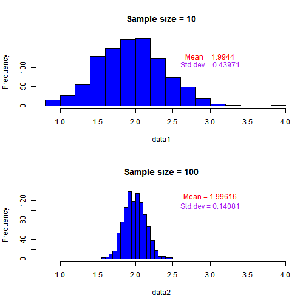

## Overview

- Statistics can be a rather abstract topic to most students
who first come into contact with it.

- Certain statistical concepts are also rather difficult to 
grasp when taught only on paper.

- We've developed an interactive website to help students
understand a key concept in statistics.

---

## Effect of Sample Size

- The sample size is an important parameter of consideration
when trying to calculate the sample mean and sample variance

- The sample standard deviation is typically known to 
follow the equation:

- The sample is however known to be invariant towards the 
sample size.

- Our website allows students to test this out themselves
using data simulated from a Poisson Model.

---

## Sample Plots

 

---

## Conclusion

- An interactive website has been designed to help students
learn statistical concepts.

- We hope this will be an invaluable tool for educators

- Interactive interfaces can also be built to illustrate 
other statistical concepts.

- App is accessible at:
https://ktw88.shinyapps.io/Data_Products/

